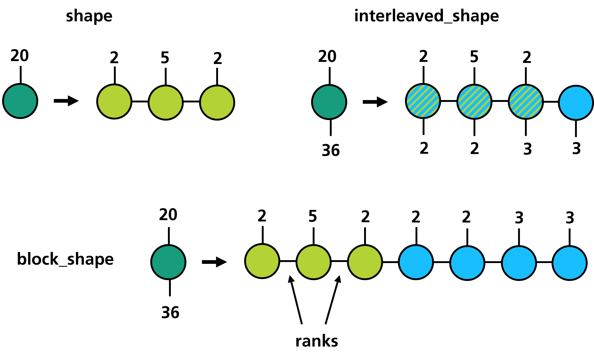

Getting Started
===============

Installation
------------

**trainsum** can be installed via pip.

.. code-block:: bash

   pip install trainsum

The dependencies are:
    - numpy
    - array_api_compat
    - opt_einsum
    - hdf5

Importing the library
---------------------

The public API of **trainsum** is provided by the :class:`~trainsum.trainsum.TrainSum` class.
Three backends are supported out of the box:

.. code-block:: python3 

   from trainsum.numpy import trainsum as ts
   from trainsum.cupy import trainsum as ts
   from trainsum.torch import trainsum as ts

Since the package uses internally the Array API standard one can also use another compatible library.
:class:`~trainsum.trainsum.TrainSum` expects the library to have mutable N-dimensional arrays with shapes that are defined at all times (which rules out JAX or Dask).

Quantized dimensions
--------------------

Having imported the library we can start with the most important concept, the quantized dimension.
A quantized dimension is a dimension of size N, which has been factorized into some integers.
With **trainsum** this can be simply done via

.. code-block:: python3 

   dim = ts.dimension(20),

where :math:`20` is factorized into :math:`2\cdot 2\cdot 5\cdot` using the prime factorization.
We can also explicitly specify the factorization by passing a list of integers to :meth:`~trainsum.trainsum.TrainSum.dimension`

.. code-block:: python3 

   dim = ts.dimension([2, 5, 2])

A :class:`~trainsum.dimension.Dimension` is a sequence of :class:`~trainsum.digit.Digit` instances, which hold the integers of the factorization.

TrainShape
----------

The next concept is the shape of a tensor train which is expressed through the class :class:`~trainsum.trainshape.TrainShape`.
It is defined as a sequence of grouped :class:`~trainsum.digit.Digit` instances.
The sequence is not unique and can be chosen arbitrarily as long as all digits of a dimension, which is part of the train, are used.
The preferred way of defining a :class:`~trainsum.trainshape.TrainShape` is with the :meth:`~trainsum.trainsum.TrainSum.trainshape` function.

.. code-block:: python3 

   from trainsum.numpy import trainsum as ts

   shape = ts.trainshape(20)

   dims = ts.dimension(20), 36
   block_shape = ts.trainshape(*dims, mode='block')

   dims = ts.dimension(20), ts.dimension(36)
   interleaved_shape = ts.trainshape(*dims, mode='interleaved')

:class:`~trainsum.trainshape.TrainShape` does not only define the arrangement of the digits within the tensor train but also the size of the internal dimensions.
These dimensions are often called bond dimensions and the corresponding sizes ranks.

Construction
------------

Using the shape of a tensor train we can finally turn towards the construction, which can be done in multiple ways.
One way is the explicit construction of functions that have a well defined tensorized structure.
This includes:
    - functions, where all values are the same
    - exponentials
    - cosine and sine
    - polynomials
    - shift matrices
    - Toeplitz tensors
    - discrete Fourier-transformation

For some of those we need a :class:`~trainsum.uniformgrid.UniformGrid`, which can be initialized with a :class:`~trainsum.dimension.Dimension` and a :class:`~trainsum.domain.Domain`.

.. code-block:: python3 

   from trainsum.numpy import trainsum as ts

   dim = ts.dimension(1024)
   domain = ts.domain(-1.0, 1.0)
   grid = ts.uniform_grid(dim, domain)

   train = ts.sin(grid, 1.0, 0.0)               # sin( 1.0 * (x-0.0) )
   train = ts.polyval(grid, [1.0, 0.0, 0.0], 0.5)  # (x-0.5)^2

Another way of defining tensor trains is with the :meth:`~trainsum.trainsum.TrainSum.tensortrain` function.
The first argument of :meth:`~trainsum.trainsum.TrainSum.tensortrain` is always a :class:`~trainsum.trainshape.TrainShape`.
The second argument can either be a full tensor or a function.
In that case the tensor or the function are converted to a tensor train.
If the second argument is a sequence of tensors, the tensors are interpreted as the tensor cores of the tensor train.

.. code-block:: python3 

   import numpy as np
   from trainsum.numpy import trainsum as ts

   shape = ts.trainshape(1024)
   domain = ts.domain(-1.0, 1.0), 
   grid = ts.uniform_grid(shape.dims, domain)

   # data approximation
   data = np.linspace(-1.0, 1.0, 1024)**2
   train = ts.tensortrain(shape, data)

   # function approximation
   func = lambda idxs: np.exp(-np.sum(grid.to_coords(idxs)**2, axis=0))
   train = ts.tensortrain(shape, data)

   # explicit construction with cores
   cores = [np.ones([1, digit.base, 1]) for digit in shape.dims[0]]
   train = ts.tensortrain(shape, cores)

Arithmetic
----------

The arithmetic of tensor networks is not at all straightforward and uses multiple algorithms and methods.
Some arithmetic operations like addition or matrix multiplication can be performed exactly within the numerical precision.
Doing so leads to a increase of the ranks and may lead to tensor trains that do not have a computational advantage.
To counteract the increasing ranks we can perform the operations approximately using either decomposition (also called zip-up) algorithms or variational algorithms.
A lot of other operations, especially element wise operations, like abs or sqrt cannot be performed exactly.
The fallback in this cases is a sampling algorithm, the cross interpolation.

The main functions for arithmetic operations are :meth:`~trainsum.trainsum.TrainSum.einsum`, :meth:`~trainsum.trainsum.TrainSum.einsum_expression`, :meth:`~trainsum.trainsum.TrainSum.add`, :meth:`~trainsum.tensortrain.TensorTrain.transform` and the magic methods of the :class:`~trainsum.tensortrain.TensorTrain` class like :code:`__mul__`.
To easily define the corresponding algorithms in the background **trainsum** heavily relies upon context manager.
There are five of them available:

===============         ========
context manager         affects
===============         ========
exact                   einsum, addition, multiplication
decomposition           einsum, addition, multiplication, tensortrain (with data)
variational             einsum, addition, multiplication, tensortrain (with data)
cross                   TensorTrain transformations, tensortrain (with function)
evaluation              TensorTrain transformations, tensortrain (with function), evaluations
===============         ========

.. code-block:: python3 

   import numpy as np
   from trainsum.numpy import trainsum as ts

   shape = ts.trainshape(1024)

   # data approximation
   data1 = np.linspace(-1.0, 1.0, 1024)**2
   train1 = ts.tensortrain(shape, data1)

   data2 = np.exp(-np.linspace(-1.0, 1.0, 1024)**2)
   train2 = ts.tensortrain(shape, data2)

   # einsum operations
   with ts.decomposition(max_rank=5, cutoff=1e-10, ncores=2): # or ts.exact/ts.variational
       res = train1 * train2
       train1 += train2
       res = ts.einsum('i,i->i', train1, res)

   # element-wise operation
   with ts.cross(max_rank=16, eps=1e-10), ts.evaluation(chunk_size=1024):
       res = train1.transform(lambda x: x**0.5)

The context managers are stored in a global dictionary with (backend, option_type, threading_id) as key and delete themselves upon calling their exit function.
One can globally set the options via :meth:`~trainsum.trainsum.TrainSum.set_options`.

Solver
------

**trainsum** provides solver for eigenvalue equations and linear equation systems.
The solver are defined by linear operators (:meth:`~trainsum.trainsum.TrainSum.linear_map`), that can be defined with einsum like expressions.
Here is a example for solving the quantum harmonic oscillator:

.. code-block:: python3 

   from trainsum.numpy import trainsum as ts

   # define the settings
   shape = ts.trainshape(1024)
   domain = ts.domain(-10.0, 10.0),
   grid = ts.uniform_grid(shape.dims, domain)

   # create the laplace operator
   dim = shape.dims[0]
   with ts.exact():
       laplace = -2*ts.shift(dim, 0)
       laplace += ts.shift(dim, 1)
       laplace += ts.shift(dim, -1)
       laplace *= -0.5/grid.spacings[0]**2
   laplace_map = ts.linear_map("ij,j->i", laplace, shape)

   # create the potential operator
   pot = ts.polyval(grid, [1.0, 0.0, 0.0], 0.0)
   pot_map = ts.linear_map("i,i->i", pot, shape)

   # define the options of the eigsolver
   decomp = ts.svdecomposition(max_rank=15, cutoff=1e-10)
   strat = ts.sweeping_strategy(ncores=2, nsweeps=10)
   loc_solver = ts.lanczos()
   
   # get the solver instance
   solver = ts.eigsolver(
       laplace_map, pot_map,
       decomposition=decomp,
       strategy=strat,
       solver=loc_solver)
   
   # create an initial guess and solve the problem
   guess = ts.full(shape, 1.0)
   res = solver(guess)

Further steps
-------------

Some applications and potential use cases are shown as Jupyter notebooks in the Examples chapter.
